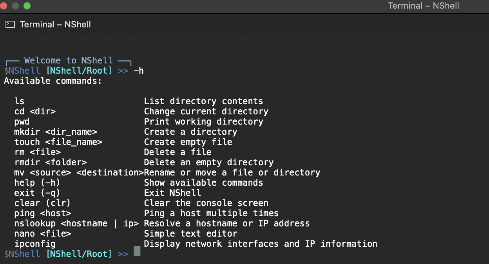
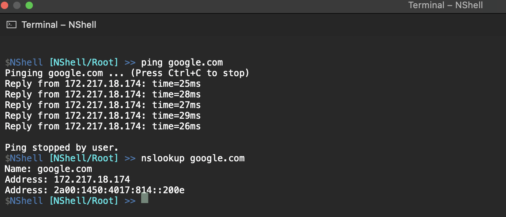

# NShell

## Table of Contents
- [Overview](#overview)
- [Features](#features)
- [Installation](#installation)
- [Usage](#usage)
- [Screenshots](#screenshots)
- [Contributions](#contributions)
- [License](#license)

---

## Overview

NShell is a custom terminal shell built in **C#** using **.NET**.  
It provides a **Unix-like command-line experience** with extensibility at its core.  

The shell includes built-in commands such as directory navigation, file management, network tools, and process-style utilities. It also supports command aliases, input history with arrow-key navigation, and is designed as a **learning project** and experimental platform for exploring **shell architecture**, **command parsing**, and **runtime extensibility** in .NET.

---

## Features
- Unix-like shell experience  
- File and directory management commands (`ls`, `cd`, `pwd`, `touch`, `rm`, `mkdir`, etc.)  
- Network utilities (`ping`, `nslookup`)  
- Command aliases support  
- Input history with arrow key navigation  
- Extensible design for adding custom commands  
- Ability to run external apps within the same terminal session  

---

## Installation
1. Clone the repository:
   ```bash
   git clone https://github.com/Nmarino8/Nshell-Terminal.git
    ```
2.	Open the solution in Visual Studio.
3.	Build the project using either Debug or Release configuration.

---

## Usage

1. Run NShell from the built executable in your terminal:
```bash
cd NShell/bin/Debug/net7.0
./NShell
```
2. Use built-in commands like:
```bash
ls, cd, pwd, touch, rm, mkdir, clear, ping
```
3. Type `help` or `-h` to see a list of all available commands.

---

## Screenshots

> [!NOTE]
> Here are some visual examples of NShell in action, demonstrating key commands and functionality.

**Help Command:**  
The `help` or `-h` command provides a list of available commands and their usage.



**IP Configuration and NSLookup:**  
The `ipconfig` and `nslookup` commands show network information, including IP addresses, gateways, and DNS resolution.



---
## Contributions

Contributions to NShell are welcome! You can help improve the project by following these steps:

1.	Fork the repository to your GitHub account.
2.	Create a feature branch for your changes:
```bash	
git checkout -b feature/YourFeature
```
3.	Make your changes and commit them with a descriptive message:
```bash
git commit -m "Add new feature"
```
4.	Push your branch to your forked repository:
```bash
git push origin feature/YourFeature
```
5.	Open a Pull Request on the main NShell repository.

**Additionally, feel free to open issues, suggest new features, or submit bug reports to help improve the project!**

---

## License

> [!IMPORTANT]
> **StudyFlow is licensed under a custom MIT-style License for personal, educational, and contribution purposes only. Commercial use or resale is not permitted without explicit permission from the author.**
>
> #### License Text
> 
> Copyright (c) 2026 Niko Marinović
>
> Permission is hereby granted, free of charge, to any person obtaining a copy
> of this software and associated documentation files (the “Software”), to use,
> copy, modify, merge, publish, distribute, and contribute to the Software for
> personal or educational purposes only. Commercial use, resale, or distribution
> for profit is **not allowed**.
>
> The above copyright notice and this permission notice shall be included in all
> copies or substantial portions of the Software.
>
> THE SOFTWARE IS PROVIDED “AS IS”, WITHOUT WARRANTY OF ANY KIND, EXPRESS OR
> IMPLIED, INCLUDING BUT NOT LIMITED TO THE WARRANTIES OF MERCHANTABILITY,
> FITNESS FOR A PARTICULAR PURPOSE AND NONINFRINGEMENT.
---
